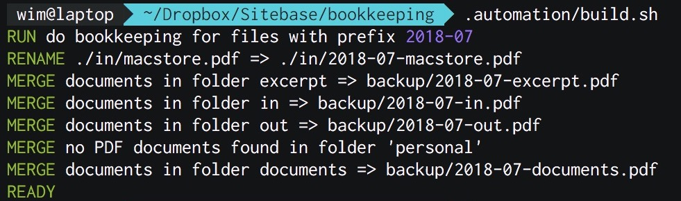

# Bookkeeping
Project to automate my bookkeeping by using Dropbox or Google drive scan function.
This script will automatically merge all PDF documents of one specific type into one document which can be send to the bookkeeper.

## Usage

* Make a folder structure like described in `Folders`
* In the root folder that contains the newly created subfolders run following command `git clone git@github.com:Sitebase/bookkeeping.git .automation`
* Merging PDFs for the previous month is done by executing `.automation/build.sh` 

I recommend placing this folder in your Dropbox or Google Drive. This way your bookkeeping will automatically get backed up.
Also this gives you the advantage of being able to use the scan function on Dropbox and Google drive to add documents using your smartphone.

## Folders
* in: Incomming invoices from 3rd parties (format: `[year]-[month]-[company]-[invoiceNR].pdf`)
* out: Outgoing invoices for delivered work and services (format: `[year]-[month]-[company]-[invoiceNR].pdf`)
* personal: papers needed for personal tax (format: `[year]-[month]-[company]-[title].pdf`)
* documents
    * receipts: food, drinks and transport receipts (format: `[year]-[month]-[restaurant].pdf`)
    * other: papers from vat, ... (format: `[year]-[month]-[company]-[title].pdf`)

## Workflow
* Use scan function on Dropbox or Google drive to scan document to one of the correct folders. Only the first part of the name is important because it needs to include the year and month of the invioce (`[year]-[month]-[name you choose].pdf`). If you don't give it a year and month prefix the script will automatically rename the file and include it in the bookkeeping of previous month.
* Run `.automation/build.sh` in the beginning of each new month. This will create the neccesary documents in the backup folder.
* Send mail to bookkeeper with the generated PDF files from the backup folder

## Subfolders
For some type of documents you want to have separate folders but they have to merge into one PDF for your bookkeeper.
This is possible by creating a folder for example `FolderA` that has two subfolders `FolderB` and `FolderC`. 
This script will merge all documents from `FolderB` and `FolderC` into a document called `FolderA.pdf`.

## PDFUnite
I used to use PDFUnite but this doesn't support merging encrypted PDF files. That's the reason I switched to the internal Mac OSX join script. 
It's slower than PDFUnite but does support encrypted PDFs and this way you don't need to install any extra dependencies on Mac.

If you do want to use PDFUnite you can easily update the `merge_pdf` function in the script and you are good to go.
